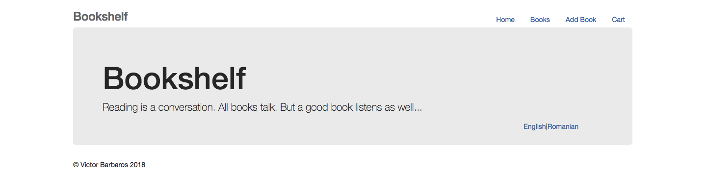
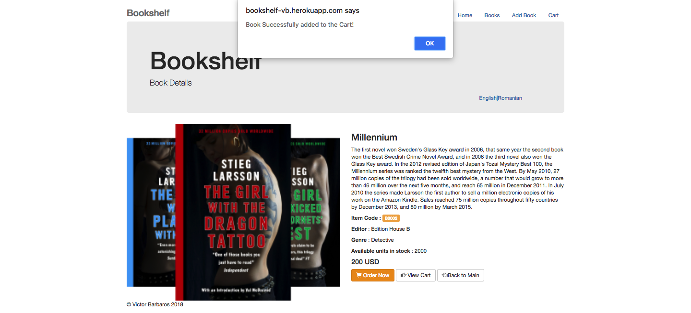
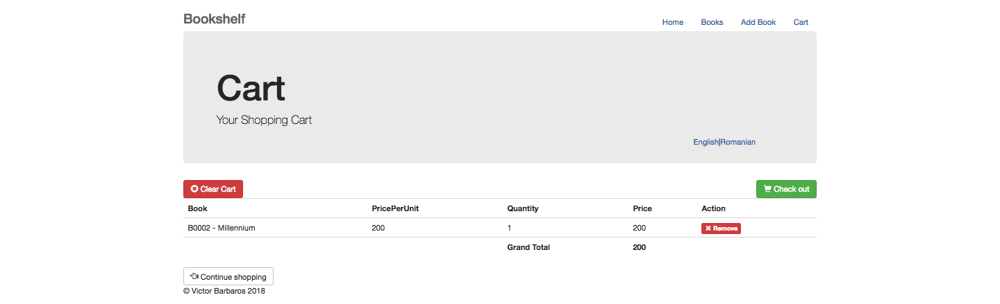
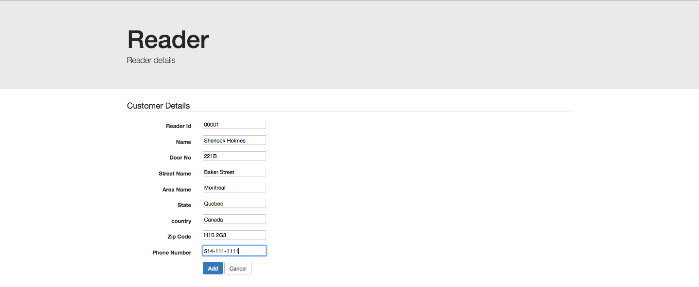
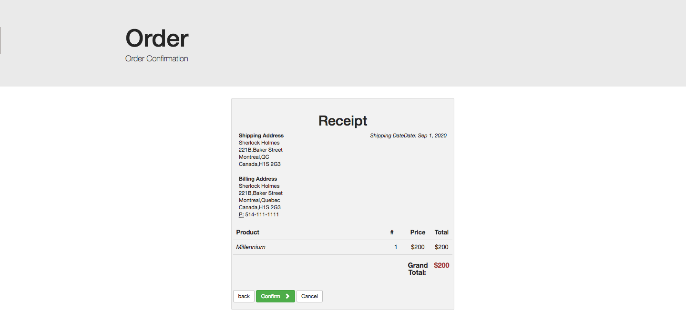
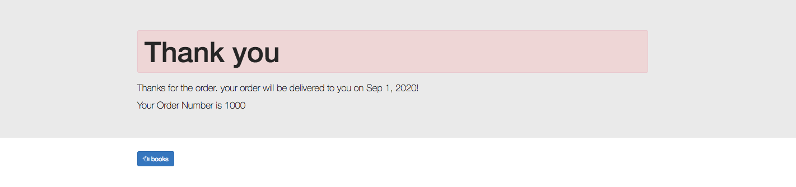
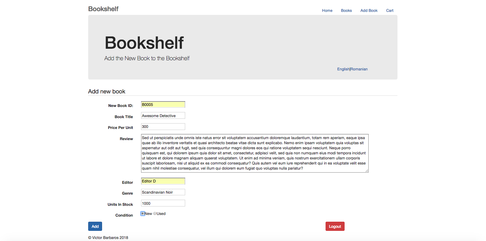

# [Bookshelf](https://bookshelf-vb.herokuapp.com/)
# Bookshelf WebApp
<table>
<tr>
<td>
  A Spring-MVC webapp showcasing the implementation of the main components in an online bookstore.
</td>
</tr>
</table>

## Hosted 

- [Heroku](https://www.heroku.com/about) - Heroku is a container-based cloud Platform as a Service (PaaS).

- Check the [bookshelf-staging ](https://bookshelf-staging.herokuapp.com/)instance;

- Check the [bookshelf-production ](https://bookshelf-vb.herokuapp.com/)instance;

### Landing Page

### Books Page

### Book Details Page

Book Details Page

Add to Card Confirmation

## Shopping & Checkout Flow (Set of Pages)

Cart Details

Costumer Details Form

Shipping Details Form

Shipping Confirmation Page

Thank You Page

### Authentication Page

Login Page

### Add New Book (Set of Pages)

Add New Book Form

New Book Added Confirmation

New Book Details

### [Development](https://github.com/vBarbaros/bookshelf/blob/dev/CONTRIBUTING.md)
Want to contribute? Great!

To fix a bug or enhance an existing module, follow these steps:

- Fork the repo
- Create a new branch (`git checkout -b improve-feature`)
- Make the appropriate changes in the files
- Add changes to reflect the changes made
- Commit your changes (`git commit -am 'Improve feature'`)
- Push to the branch (`git push origin improve-feature`)
- Create a Pull Request 

### Bug / Feature Request

If you find a bug kindly open an issue [here](https://github.com/vBarbaros/bookshelf/issues/new) by including the steps to reproduce it.

If you'd like to request a new function, feel free to do so by opening an issue [here](https://github.com/vBarbaros/bookshelf/issues/new).

## Built with 

- [Maven](https://maven.apache.org/index.html) - Apache Maven is a software project management and comprehension tool. Based on the concept of a project object model (POM), Maven can manage a project's build, reporting and documentation from a central piece of information.

## To-do
- Add Unit and Integration Tests;
- Add CI using Travis CI;
- Add the feature of uploading an image from local machine, whenever a new book is added;
- (...to be added, there is always stuff that can be added);

## [License](https://github.com/vBarbaros/bookshelf/blob/dev/LICENSE)

MIT © [Victor Barbaros](https://github.com/vBarbaros)
=======
# bookshelf